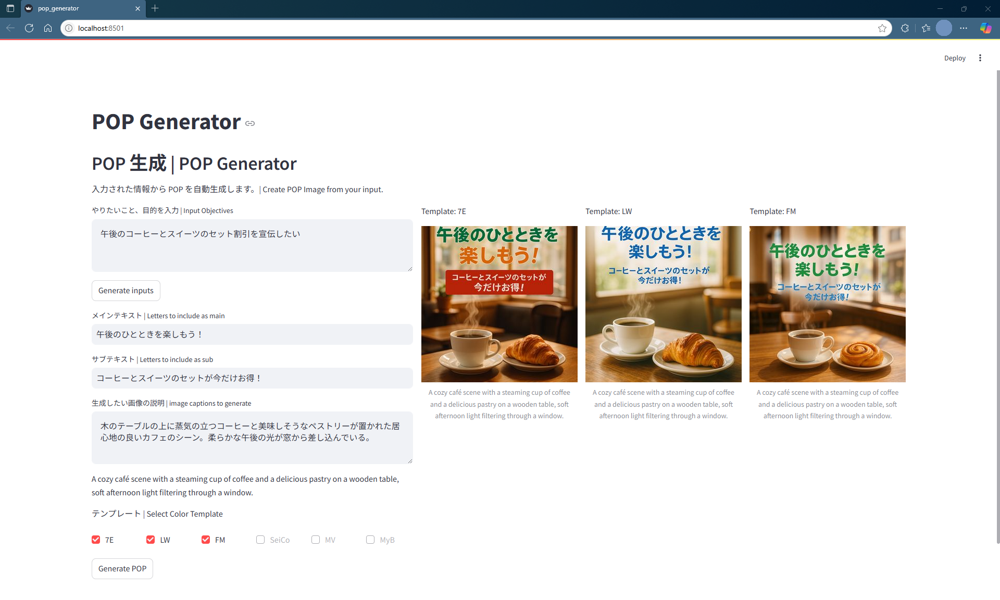

# RetailPopGenerator
Retail Store POP Generator

小売店舗の POP (テキストと画像) を自動生成します。/ Auto-create POP (text and image) for retail stores。

<!-- App Screenshot -->


## 利用方法 | Usage

### 前提条件 | Prerequisites
- Python 3.8 以上 / Python 3.8 or higher
- チャットおよび画像生成用の Azure OpenAI リソース / Azure OpenAI resource with chat and image deployments (GPT-4o-mini && GPT-Image-1)


### インストール | Installation
```powershell
# 仮想環境の作成と有効化 / Create and activate virtual environment
python -m venv .venv
.\.venv\Scripts\Activate.ps1

# 依存パッケージのインストール / Install dependencies
pip install -r requirements.txt
```

### 設定方法 | Configuration
`.env_sample` を `.env` としてプロジェクトルートにコピーし、以下の変数を設定してください。 / Copy `.env_sample` to `.env` in the project root and set the following variables:
```dotenv
AOAI_ENDPOINT=<your-azure-openai-endpoint>
AOAI_KEY=<your-azure-openai-key>
AOAI_API_VERSION=<api-version>
AOAI_CHAT_DEPLOYMENT_NAME=<chat-deployment-name>
AOAI_IMAGE_DEPLOYMENT_NAME=<image-deployment-name>
```

### 実行方法 | Running the App
```powershell
streamlit run main.py
```

